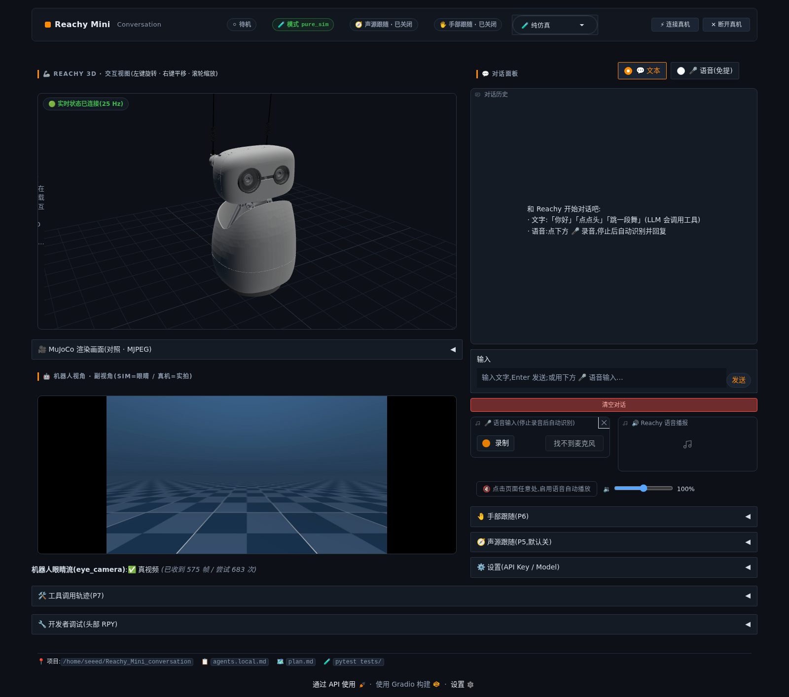

# Reachy Mini Conversation

[](LICENSE)
[](environment.yml)
[](https://github.com/pollen-robotics/reachy_mini)

> **对话式机器人应用 / Conversational robot app**
>
> 基于 [Reachy Mini](https://www.pollen-robotics.com/reachy-mini/) SDK,使用**豆包大模型 (Doubao)** + **豆包流式语音识别 (WebSocket ASR)** + **Edge TTS** 提供完整的语音对话体验。
>
> Web UI 基于 **Gradio**,支持 Mujoco 仿真与真机镜像、声源定位驱动头部、MediaPipe 手部跟随。

[English](#english) | [中文](#中文)

---

## 中文

### 简介

Reachy Mini Conversation 是一个开源的对话机器人应用,为 Pollen Robotics 的 Reachy Mini 机器人设计。它把豆包大语言模型(豆包方舟 Ark)、豆包流式语音识别 WebSocket API、Edge TTS 三者串起来,通过 Reachy Mini SDK 实现:

- 🎙️ **语音对话**:说中文 → 豆包 ASR 实时识别 → 豆包 LLM 回复(可调用动作工具)→ Edge TTS 播音,动作与语音并行
- 🦾 **身体动作**:LLM 主动调工具(dance / move_head / play_emotion / idle_sway 等),后台执行不阻塞对话
- 👂 **声源定位**:麦克风阵列检测说话人方向,自动转头(默认关,可选开)
- 👋 **手部跟随**:MediaPipe 检测手掌,头部实时跟随(对话说「开始手部跟随」或 UI 开关)
- 🪞 **真机↔仿真镜像**:左侧 three.js 交互式 3D 视图 + Mujoco 渲染对照,右侧真机摄像头实时画面
- 💤 **待机微动**:空闲时呼吸式头部微动 + 天线摆动(官方 BreathingMove 移植),说话时自动切换为音频驱动的摆头
- 🌐 **Gradio Web UI**:浏览器打开 `localhost:7860` 即可使用,深色主题

**适用硬件**:Reachy Mini Lite(有线 USB)与无线版(RPi CM4 本体);仿真模式无需硬件。三种形态一条命令隔离:`--sim` / `--wired` / `--robot`(见下文)。

### 效果展示



### 快速上手(Linux,5 分钟)

**前置**:Ubuntu / Debian 系统,Python 3.12,sudo 权限。

```bash
# 1. 克隆仓库(目录名保持 Reachy_Mini_conversation)
git clone https://github.com/TheMoonAstronaut/Reachy_Mini_conversation.git
cd Reachy_Mini_conversation

# 2. 安装系统依赖(cairo / gstreamer / ffmpeg)
sudo ./scripts/install_deps.sh

# 3. 创建并激活 conda 环境
conda env create -f environment.yml
conda activate reachy

# 4. 安装 Python 包
pip install -e ".[dev]"

# 5. 配置 API Key(见下一节,语音对话必需)

# 6. (可选)下载手部跟随模型(~8 MB)
mkdir -p ~/.cache/reachymini
curl -L -o ~/.cache/reachymini/hand_landmarker.task \
  https://storage.googleapis.com/mediapipe-models/hand_landmarker/hand_landmarker/float16/latest/hand_landmarker.task

# 7. 启动(三种形态一条命令隔离,各自独立日志)
./scripts/start.sh --sim        # 纯仿真(默认,跑在 PC)
./scripts/start.sh --wired      # 有线真机:PC + USB 接入的机器人(启动即自动连)
./scripts/start.sh --robot      # 无线版唯一形态:跑在机器人树莓派本体(SSH 上去执行)
# 日志:logs/start-<模式>-<时间戳>.log
```

启动后浏览器打开 [http://localhost:7860](http://localhost:7860)。
切换调试模式:Ctrl+C 停掉换命令重启(sim daemon 健康实例自动复用)。

**局域网访问**:UI 监听 `0.0.0.0`,同一 WiFi 下的手机/平板/其他电脑直接用
`http://<本机局域网IP>:7860` 打开即可(启动时控制台会打印,如
`http://192.168.x.x:7860`);视频流、3D 视图、语音播报会自动跟随访问用
的 IP,无需任何配置。

> ⚠️ 安全提示:局域网链接意味着**同网络的任何人都能控制机器人**,请只在
> 可信 WiFi 下使用,不要在公共网络开放。
>
> 📱 手机浏览器输入链接时请**带 `http://` 前缀**(部分浏览器默认升级
> https 会报"连接不安全")。打不开先查
> [`docs/TROUBLESHOOTING.md`](docs/TROUBLESHOOTING.md) 第 0 节。

**连接真机(有线)**:给 Reachy Mini 通电 → 顶栏点「⚡ 连接真机」(有线 USB 自动识别,或 `./scripts/start.sh --wired` 启动即自动连)。连接后语音对话、手部跟随、真机摄像头画面自动可用。

**跑在机器人本体上(无线版)**:无线版内置树莓派 CM4,可以直接把项目
部署到机器人上,同一 WiFi 下任意设备打开 UI 控制,无需 PC 常驻 —— 见
 [`docs/ROBOT.md`](docs/ROBOT.md)(`./scripts/start.sh --robot`)。

**语音对话**:对话面板切到「🎤 语音(免提)」→ 真机模式直接对机器人说话(机器人麦克风收音、扬声器播音);仿真模式用浏览器麦克风,声音从电脑音箱出。

### 配置 API Key

把 API Key 写到 `~/.reachymini/env.json`(用户级配置,不入 git):

```bash
mkdir -p ~/.reachymini
cat > ~/.reachymini/env.json <<'EOF'
{
  "doubao_llm": {
    "api_key": "your-ark-api-key",
    "model": "doubao-seed-character-251128"
  },
  "doubao_asr": {
    "api_key": "your-asr-api-key"
  },
  "edge_tts": {
    "voice": "zh-CN-XiaoxiaoNeural"
  }
}
EOF
chmod 600 ~/.reachymini/env.json
```

也可以在 UI 里展开「⚙️ 设置(API Key / Model)」在线编辑保存(保存后需重启进程生效)。

申请地址:
- **豆包 LLM**:[火山引擎方舟控制台](https://www.volcengine.com/docs/6561/1354869)
- **豆包 ASR**:[火山引擎语音技术](https://www.volcengine.com/product/asr)

全部配置项见 [`docs/CONFIG.md`](docs/CONFIG.md)。

### 系统架构(简版)

```
┌──────────────────────────────────────┐
│  Web UI (Gradio @ localhost:7860)    │
│  ┌─────────────┐ ┌─────────────────┐ │
│  │ 3D 视图+视频 │ │  对话 / 配置面板 │ │
│  └─────────────┘ └─────────────────┘ │
└──────────────────────────────────────┘
                 ↕
┌──────────────────────────────────────┐
│  App 进程                             │
│  MirrorOrchestrator │ VoicePipeline   │
│  ├ sim + real 镜像   │ ASR→LLM→TTS    │
│  SoundLocalizer │ HandFollower        │
│  IdleBreath(待机微动)                 │
└──────────────────────────────────────┘
                 ↕
┌──────────────────────────────────────┐
│  reachy_mini SDK (1.10.0)             │
└──────────────────────────────────────┘
                 ↕
┌──────────────────────────────────────┐
│  硬件 / 仿真                         │
│  reachy-mini-daemon --sim / 真机      │
└──────────────────────────────────────┘
```

详细架构见 [`docs/ARCHITECTURE.md`](docs/ARCHITECTURE.md)。

### 故障排查

遇到问题先查 [`docs/TROUBLESHOOTING.md`](docs/TROUBLESHOOTING.md)。

常见问题:
- **找不到 conda**:安装 [Miniconda](https://docs.conda.io/en/latest/miniconda.html)
- **端口被占(7860/7861/8000/8001)**:`lsof -i :7860` 找占用进程杀掉再启动
- **浏览器听不到声音**:页面上先点任意处(浏览器自动播放策略),或检查 🔊 音量滑条
- **录音没声音**:确认系统默认输入源是活麦克风(`pactl info | grep 默认源`),部分机器默认是哑设备
- **真机连不上**:确认已通电、USB 线插紧(有线版);日志看 `/tmp/reachy-daemon.log`

### 贡献 & 许可证

- 许可证:[Apache 2.0](LICENSE)(与 [reachy_mini](https://github.com/pollen-robotics/reachy_mini) 一致)
- 开发:`pytest tests/`(290 用例);代码风格 `black` + `ruff`(line-length 100)

---

## English

### Overview

Reachy Mini Conversation is an open-source conversational robot app for the Pollen Robotics Reachy Mini. It wires together **Doubao LLM (Ark)**, **Doubao streaming ASR (WebSocket)**, and **Edge TTS** through the Reachy Mini SDK to deliver:

- 🎙 **Voice conversation**: speak Chinese → Doubao ASR streams text → Doubao LLM replies (with tool calls) → Edge TTS plays, motion runs in parallel
- 🦾 **Body motion**: LLM calls tools (dance / move_head / play_emotion / idle_sway) executed in background threads
- 👂 **Sound source localization**: microphone array locates the speaker, robot turns its head (off by default)
- 👋 **Hand following**: MediaPipe palm detection, head tracks in real time (say "开始手部跟随" or use the UI toggle)
- 🪞 **Real ↔ sim mirroring**: three.js interactive 3D view + Mujoco render, real camera feed
- 💤 **Idle motion**: breathing-style micro-movements ported from the official BreathingMove; audio-reactive wobble while speaking
- 🌐 **Gradio Web UI**: open `localhost:7860` in a browser, dark theme

**Supported hardware**: Reachy Mini Lite (USB wired) and the wireless variant (RPi CM4); pure simulation needs no hardware. Three modes via separate commands: `--sim` / `--wired` / `--robot`.

### Demo


### Quick start (Linux, 5 minutes)

**Prerequisites**: Ubuntu / Debian, Python 3.12, sudo.

```bash
git clone https://github.com/TheMoonAstronaut/Reachy_Mini_conversation.git
cd Reachy_Mini_conversation

sudo ./scripts/install_deps.sh

conda env create -f environment.yml
conda activate reachy
pip install -e ".[dev]"

# write API keys to ~/.reachymini/env.json (see "Configure API keys" below)

# (optional) hand-follower model (~8 MB)
mkdir -p ~/.cache/reachymini
curl -L -o ~/.cache/reachymini/hand_landmarker.task \
  https://storage.googleapis.com/mediapipe-models/hand_landmarker/hand_landmarker/float16/latest/hand_landmarker.task

./scripts/start.sh --ui
```

Then open [http://localhost:7860](http://localhost:7860).

**LAN access**: the UI listens on `0.0.0.0` — any phone / tablet / laptop on the same WiFi can open `http://<this-PC's-LAN-IP>:7860` directly (printed in the startup banner). Video feeds, the 3D view and TTS autoplay automatically follow whatever host was used to open the page — zero configuration.

> ⚠️ **Security note**: a LAN link means **anyone on the same network can control the robot**. Use only on trusted WiFi.

**Connect the real robot (wired)**: power it on → click "⚡ 连接真机" in the top bar (wired USB auto-detected; or launch with `./scripts/start.sh --wired` for auto-connect).

### Configure API keys

Write API keys to `~/.reachymini/env.json` (user-level, never committed):

```bash
mkdir -p ~/.reachymini
cat > ~/.reachymini/env.json <<'EOF'
{
  "doubao_llm": { "api_key": "your-ark-api-key", "model": "doubao-seed-character-251128" },
  "doubao_asr": { "api_key": "your-asr-api-key" },
  "edge_tts":   { "voice": "zh-CN-XiaoxiaoNeural" }
}
EOF
chmod 600 ~/.reachymini/env.json
```

- **Doubao LLM**: [Volcano Engine Ark console](https://www.volcengine.com/docs/6561/1354869)
- **Doubao ASR**: [Volcano Engine ASR](https://www.volcengine.com/product/asr)

See [`docs/CONFIG.md`](docs/CONFIG.md) for all options.

### Troubleshooting

See [`docs/TROUBLESHOOTING.md`](docs/TROUBLESHOOTING.md).

### Contributing / License

- License: [Apache 2.0](LICENSE)(same as [reachy_mini](https://github.com/pollen-robotics/reachy_mini))
- Dev: `pytest tests/` (290 cases); code style `black` + `ruff` (line-length 100)

---

## Roadmap

- ✅ 已完成:Web UI + Mujoco 仿真镜像、豆包 ASR 语音管线、声源定位、
  手部跟随、LLM 工具调用、局域网访问、三形态命令隔离(`--sim` /
  `--wired` / `--robot`)、on-robot 部署(无线版树莓派本体)
- 🟡 P8:Windows 完整适配(脚本模板已就位,待真机验证)
- 🔵 P9.2 后续:on-robot 的手部跟随降级方案(浏览器端 JS MediaPipe,
  规避 CM4 缺 AES 指令无法运行 MediaPipe Python 的限制)
- 已知硬件向限制:on-robot 模式下机器人麦克风若录音全零,按
  [`docs/ROBOT.md`](docs/ROBOT.md) 麦克风排障节处理(FPC 排线插反为
  官方首位原因)

## Related projects

- [reachy_mini SDK](https://github.com/pollen-robotics/reachy_mini) — Pollen Robotics
- [reachy_mini_conversation_app](https://github.com/pollen-robotics/reachy_mini_conversation_app) — official HF-Realtime reference
- [reachy_mini_dances_library](https://github.com/pollen-robotics/reachy_mini_dances_library) — dance moves
