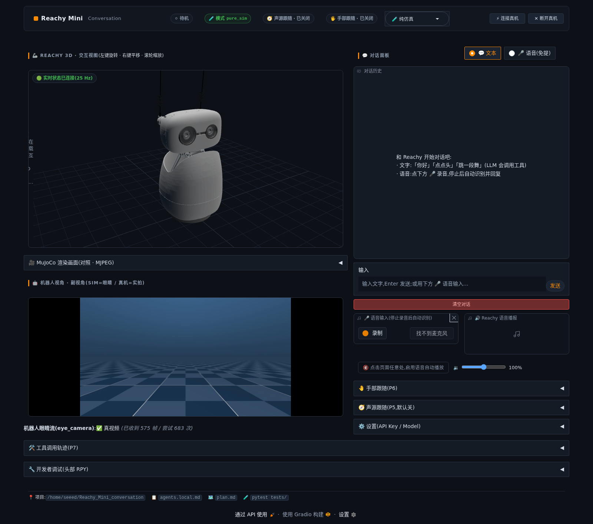

# Reachy Mini Conversation

[](LICENSE)
[](environment.yml)
[](https://github.com/pollen-robotics/reachy_mini)

> **对话式机器人应用 / Conversational robot app**
>
> 基于 [Reachy Mini](https://www.pollen-robotics.com/reachy-mini/) SDK,使用**豆包大模型 (Doubao)** + **豆包流式语音识别 (WebSocket ASR)** + **Edge TTS** 提供完整的语音对话体验。
>
> Web UI 基于 **Gradio**,支持 Mujoco 仿真与真机镜像、声源定位驱动头部、MediaPipe 手部跟随。

[English](#english) | [中文](#中文)

---

## 中文

### 简介

Reachy Mini Conversation 是一个开源的对话机器人应用,为 Pollen Robotics 的 Reachy Mini 机器人设计。它把豆包大语言模型(豆包方舟 Ark)、豆包流式语音识别 WebSocket API、Edge TTS 三者串起来,通过 Reachy Mini SDK 实现:

- 🎙️ **语音对话**:说中文 → 豆包 ASR 实时识别 → 豆包 LLM 回复(可调用动作工具)→ Edge TTS 播音,动作与语音并行
- 🦾 **身体动作**:LLM 主动调工具(dance / move_head / play_emotion / idle_sway 等),后台执行不阻塞对话
- 👂 **声源定位**:麦克风阵列检测说话人方向,自动转头(默认关,可选开)
- 👋 **手部跟随**:MediaPipe 检测手掌,头部实时跟随(对话说「开始手部跟随」或 UI 开关)
- 🪞 **真机↔仿真镜像**:左侧 three.js 交互式 3D 视图 + Mujoco 渲染对照,右侧真机摄像头实时画面
- 💤 **待机微动**:空闲时呼吸式头部微动 + 天线摆动(官方 BreathingMove 移植),说话时自动切换为音频驱动的摆头
- 🌐 **Gradio Web UI**:浏览器打开 `localhost:7860` 即可使用,深色主题

**适用硬件**:Reachy Mini Lite(有线 USB)与无线版(RPi CM4 本体);仿真模式无需硬件。三种形态一条命令隔离:`--sim` / `--wired` / `--robot`。

### 效果展示



### 快速上手:三种配置方式,按你的环境选一条

| 你的情况 | 走哪条 |
|----------|--------|
| **有线版机器人** + Ubuntu PC | 👉 [方式 A:Ubuntu](#方式-aubuntu有线真机--纯仿真5-分钟) |
| **有线版机器人** + Windows PC | 👉 [方式 B:Windows](#方式-bwindows有线真机--纯仿真) |
| **无线版机器人**(内置树莓派 CM4) | 👉 [方式 C:无线版](#方式-c无线版跑在机器人本体) |
| 还没买机器人,先体验仿真 | 任选 A / B 的纯仿真模式,无需硬件 |

三者的**配置 API Key、局域网访问、故障排查**是共用的,见各自章节之后的[公共部分](#配置-api-key)。

#### 方式 A:Ubuntu(有线真机 / 纯仿真,5 分钟)

**前置**:Ubuntu / Debian 系统,Python 3.12(conda 提供),sudo 权限。
已在 Ubuntu 22.04 全新环境实测通过(290 测试全过 + 真机全链路验收)。

```bash
# 1. 克隆仓库
git clone https://github.com/TheMoonAstronaut/Reachy_Mini_conversation.git
cd Reachy_Mini_conversation

# 2. 安装系统依赖(cairo / gstreamer / ffmpeg)
sudo ./scripts/install_deps.sh

# 3. 创建并激活 conda 环境
conda env create -f environment.yml
conda activate reachy

# 4. 安装 Python 包 + SDK 降级补丁
pip install -e ".[dev]"
./scripts/patch_sdk_p7b.sh
# ↑ Ubuntu 22.04 必需:官方仓库没有 gst-plugins-rs,webrtcsink 缺失时
#   SDK 原版直接抛错导致整个应用起不来;补丁降级为"仅本地 IPC"。
#   脚本幂等,重建 conda 环境 / 升级 reachy-mini 后重跑一次即可。

# 5. (可选,推荐)防止机器人 USB 频繁掉线:禁用 autosuspend
sudo cp scripts/udev/50-reachy-mini-usb.rules /etc/udev/rules.d/
sudo udevadm control --reload && sudo udevadm trigger

# 6. 配置 API Key(见下方「配置 API Key」,语音对话必需)

# 7. (可选)下载手部跟随模型(~8 MB,不装则「手部跟随」不可用)
mkdir -p ~/.cache/reachymini
curl -L -o ~/.cache/reachymini/hand_landmarker.task \
  https://storage.googleapis.com/mediapipe-models/hand_landmarker/hand_landmarker/float16/latest/hand_landmarker.task
# 国内访问不通时换 GitHub 镜像:
# curl -L -o ~/.cache/reachymini/hand_landmarker.task \
#   "https://gh-proxy.com/https://raw.githubusercontent.com/google-ai-edge/mediapipe-samples/main/examples/hand_landmarker/ios/HandLandmarker/hand_landmarker.task"

# 8. 启动(三种形态一条命令隔离,各自独立日志)
./scripts/start.sh --sim        # 纯仿真(默认,跑在 PC)
./scripts/start.sh --wired      # 有线真机:PC + USB 接入的机器人(启动即自动连)
./scripts/start.sh --robot      # 无线版唯一形态:跑在机器人树莓派本体(SSH 上去执行)
# 日志:logs/start-<模式>-<时间戳>.log
```

启动后浏览器打开 [http://localhost:7860](http://localhost:7860)。
切换调试模式:Ctrl+C 停掉换命令重启(sim daemon 健康实例自动复用)。

> 🐧 **Ubuntu 提示**:装完可先跑 `python -m pytest tests/` 自检(期望 290 全过,
> skip 为无硬件相关);更多细节见 [`docs/INSTALL.md`](docs/INSTALL.md) Linux 章节。

#### 方式 B:Windows(有线真机 / 纯仿真)

支持原生 Windows(官方 SDK 经 `gstreamer-bundle` 自动带 GStreamer,无需手动装 GTK)。以下步骤已在 Windows 11 + conda 实测通过(仿真 daemon + Web UI + 视频流全链路 OK,全套测试 267 通过 / 13 跳过):

```powershell
# ---------- 1. 创建 Python 3.12 环境(名字随意) ----------
# 若报 NoChannelsConfiguredError(.condarc 里 channels 为空),先配一次镜像:
conda config --add channels https://mirrors.tuna.tsinghua.edu.cn/anaconda/pkgs/main/
conda create -n reachy-conversation-test python=3.12 -y
conda activate reachy-conversation-test

# ---------- 2. 安装依赖 ----------
# 注意:一律用 python -m pip。SDK(reachy_mini>=1.10)声明 pip>=26.1,
# 不带 -m 的裸 pip 在自升级时会被拒绝("To modify pip..." 报错)。
# mujoco(仿真 daemon 需要)已包含在项目依赖里,无需单独装。
# 首次 pip 会触发 gstreamer-bundle 后安装下载(数十 MB,国内耐心等或换镜像)。
python -m pip install -e ".[dev]"

# ---------- 3. (仅当报 DLL 错时)修复 GStreamer bundle 的 libexpat 冲突 ----------
# 正常情况下无需操作:包导入时(含 daemon B 子进程)会自动预加载 conda 的
# 兼容 libexpat。若绕开本包直接 import reachy_mini 后遇到 "DLL load
# failed while importing pyexpat",再执行下面的手动替换(先备份):
$envs = python -c "import sys; print(sys.prefix)"   # 当前环境路径
Copy-Item "$envs\Lib\site-packages\gstreamer_libs\bin\libexpat.dll" `
          "$envs\Lib\site-packages\gstreamer_libs\bin\libexpat.dll.bak"
Copy-Item "$envs\Library\bin\libexpat.dll" `
          "$envs\Lib\site-packages\gstreamer_libs\bin\libexpat.dll" -Force

# ---------- 4. 配置 API Key(可选,纯仿真看 UI 可跳过) ----------
mkdir ~\.reachymini
notepad ~\.reachymini\env.json   # 内容见下文「配置 API Key」节
# 国内网络注意:edge-tts 直连微软语音端点 TLS 频繁被重置(现象=合成频繁
# 超时重试)。有本地代理(Clash/v2ray 等)时在 env.json 加一行即可走代理:
#   "edge_tts": { "voice": "zh-CN-XiaoxiaoNeural", "proxy": "http://127.0.0.1:7890" }

# ---------- 5. (可选)手部跟随模型(~8MB,不装则「手部跟随」不可用) ----------
# 官方源 storage.googleapis.com 国内不通,用 GitHub 镜像(gh-proxy):
mkdir ~\.cache\reachymini
curl.exe -L -o ~\.cache\reachymini\hand_landmarker.task `
  "https://gh-proxy.com/https://raw.githubusercontent.com/google-ai-edge/mediapipe-samples/main/examples/hand_landmarker/ios/HandLandmarker/hand_landmarker.task"
# 若 gh-proxy.com 也不通,依次尝试替换域名:ghfast.top / mirror.ghproxy.com

# ---------- 6. 启动 ----------
.\scripts\start.ps1            # 纯仿真
.\scripts\start.ps1 -Wired     # 有线真机(机器人 USB 插本机,启动即自动连)
# 环境解析:优先 conda 环境 reachy;没有则用当前已激活的环境(检查
# reachy_mini 可导入)。手动起两个终端的等价命令:
#   终端1: $env:REACHYMINI_RUN_MODE="pure_sim"; python -m reachymini_conversation.daemon_launcher --sim --headless
#   终端2: python -m reachymini_conversation --ui

# ---------- 7. 验证安装 ----------
python -m pytest tests/   # 期望:全通过,skip 为 v4l2(Linux-only)/无硬件相关
```

细节见 [`docs/INSTALL.md`](docs/INSTALL.md) Windows 章节;
排障先查 [`docs/TROUBLESHOOTING.md`](docs/TROUBLESHOOTING.md) 的 Windows 节
(串口"函数不正确/拒绝访问"、TTS 超时、libexpat DLL、断开不休眠等都在里面有)。

> 🪟 **Windows 专用提示**:`scripts/install_deps.sh` / `install_deps.ps1`
> 是历史遗留脚本,**不需要运行**——Windows 的 GStreamer/PyGObject 由
> pip 的 gstreamer-bundle 自动处理,按上面 1-6 步即可。

#### 方式 C:无线版(跑在机器人本体)

无线版内置树莓派 CM4(官方 daemon 已在上面运行:电机 + 相机 + 麦克风 + 扬声器)。
把项目部署到机器人本体后,**同一 WiFi 下任意设备的浏览器都能直接控制机器人**,
无需 PC 常驻、无需 USB 线:

1. `ssh pollen@reachy-mini.local` 上树莓派(官方系统 Raspberry Pi OS)
2. 装系统依赖 → 建 conda 环境 → `pip install -e .`(同方式 A,CM4 为 aarch64)
3. `./scripts/start.sh --robot` 启动 on-robot 模式(纯真机 `pure_real`,不跑仿真)
4. 同 WiFi 设备打开 `http://reachy-mini.local:7860`

> 📡 注意:CM4 缺 ARMv8 crypto 指令,Python 版 MediaPipe 手部跟随在
> 本体上不可用(自动降级,其余功能正常)。麦克风录音异常先查 FPC 排线。

完整步骤(含麦克风/扬声器排障)见 [`docs/ROBOT.md`](docs/ROBOT.md)。

---

### 配置 API Key(三种方式共用)

把 API Key 写到 `~/.reachymini/env.json`(用户级配置,不入 git):

```bash
mkdir -p ~/.reachymini
cat > ~/.reachymini/env.json <<'EOF'
{
  "doubao_llm": {
    "api_key": "your-ark-api-key",
    "model": "doubao-seed-character-251128"
  },
  "doubao_asr": {
    "api_key": "your-asr-api-key"
  },
  "edge_tts": {
    "voice": "zh-CN-XiaoxiaoNeural"
  }
}
EOF
chmod 600 ~/.reachymini/env.json
```

也可以在 UI 里展开「⚙️ 设置(API Key / Model)」在线编辑保存(UI 保存后
新对话立即生效;直接改文件需重启进程)。

申请地址:
- **豆包 LLM**:[火山引擎方舟控制台](https://www.volcengine.com/docs/6561/1354869)
- **豆包 ASR**:[火山引擎语音技术](https://www.volcengine.com/product/asr)

全部配置项见 [`docs/CONFIG.md`](docs/CONFIG.md)。

### 局域网访问(三种方式共用)

UI 监听 `0.0.0.0`,同一 WiFi 下的手机/平板/其他电脑直接用
`http://<本机局域网IP>:7860` 打开即可(启动时控制台会打印,如
`http://192.168.x.x:7860`;无线版用 `http://reachy-mini.local:7860`);
视频流、3D 视图、语音播报会自动跟随访问用的 IP,无需任何配置。

> ⚠️ 安全提示:局域网链接意味着**同网络的任何人都能控制机器人**,请只在
> 可信 WiFi 下使用,不要在公共网络开放。
>
> 📱 手机浏览器输入链接时请**带 `http://` 前缀**(部分浏览器默认升级
> https 会报"连接不安全")。打不开先查
> [`docs/TROUBLESHOOTING.md`](docs/TROUBLESHOOTING.md) 第 0 节。

### 连接真机(有线)

给 Reachy Mini 通电 → 顶栏点「⚡ 连接真机」(有线 USB 自动识别,或
`./scripts/start.sh --wired` 启动即自动连)。连接后语音对话、手部跟随、
真机摄像头画面自动可用。

### 语音对话

对话面板切到「🎤 语音(免提)」→ 真机模式直接对机器人说话(机器人麦克风收音、
扬声器播音);仿真模式用浏览器麦克风,声音从电脑音箱出。

### 系统架构(简版)

```
┌──────────────────────────────────────┐
│  Web UI (Gradio @ localhost:7860)    │
│  ┌─────────────┐ ┌─────────────────┐ │
│  │ 3D 视图+视频 │ │  对话 / 配置面板 │ │
│  └─────────────┘ └─────────────────┘ │
└──────────────────────────────────────┘
                 ↕
┌──────────────────────────────────────┐
│  App 进程                             │
│  MirrorOrchestrator │ VoicePipeline   │
│  ├ sim + real 镜像   │ ASR→LLM→TTS    │
│  SoundLocalizer │ HandFollower        │
│  IdleBreath(待机微动)                 │
└──────────────────────────────────────┘
                 ↕
┌──────────────────────────────────────┐
│  reachy_mini SDK (1.10.0)             │
└──────────────────────────────────────┘
                 ↕
┌──────────────────────────────────────┐
│  硬件 / 仿真                         │
│  reachy-mini-daemon --sim / 真机      │
└──────────────────────────────────────┘
```

详细架构见 [`docs/ARCHITECTURE.md`](docs/ARCHITECTURE.md)。

### 故障排查

遇到问题先查 [`docs/TROUBLESHOOTING.md`](docs/TROUBLESHOOTING.md)。

常见问题:
- **找不到 conda**:安装 [Miniconda](https://docs.conda.io/en/latest/miniconda.html)
- **端口被占(7860/7861/8000/8001)**:`lsof -i :7860` 找占用进程杀掉再启动
- **浏览器听不到声音**:页面上先点任意处(浏览器自动播放策略),或检查 🔊 音量滑条
- **录音没声音**:确认系统默认输入源是活麦克风(`pactl info | grep 默认源`),部分机器默认是哑设备
- **真机连不上**:确认已通电、USB 线插紧(有线版);日志看 `/tmp/reachy-daemon.log`
- **Ubuntu 应用起不来报 WebRTC 连接拒绝**:漏跑 `./scripts/patch_sdk_p7b.sh`
- **机器人 USB 频繁掉线/真机画面卡死**:装 `scripts/udev/50-reachy-mini-usb.rules`(方式 A 第 5 步)

### 贡献 & 许可证

- 许可证:[Apache 2.0](LICENSE)(与 [reachy_mini](https://github.com/pollen-robotics/reachy_mini) 一致)
- 开发:`pytest tests/`(290 用例);代码风格 `black` + `ruff`(line-length 100)

---

## English

### Overview

Reachy Mini Conversation is an open-source conversational robot app for the Pollen Robotics Reachy Mini. It wires together **Doubao LLM (Ark)**, **Doubao streaming ASR (WebSocket)**, and **Edge TTS** through the Reachy Mini SDK to deliver:

- 🎙 **Voice conversation**: speak Chinese → Doubao ASR streams text → Doubao LLM replies (with tool calls) → Edge TTS plays, motion runs in parallel
- 🦾 **Body motion**: LLM calls tools (dance / move_head / play_emotion / idle_sway) executed in background threads
- 👂 **Sound source localization**: microphone array locates the speaker, robot turns its head (off by default)
- 👋 **Hand following**: MediaPipe palm detection, head tracks in real time (say "开始手部跟随" or use the UI toggle)
- 🪞 **Real ↔ sim mirroring**: three.js interactive 3D view + Mujoco render, real camera feed
- 💤 **Idle motion**: breathing-style micro-movements ported from the official BreathingMove; audio-reactive wobble while speaking
- 🌐 **Gradio Web UI**: open `localhost:7860` in a browser, dark theme

**Supported hardware**: Reachy Mini Lite (USB wired) and the wireless variant (RPi CM4); pure simulation needs no hardware. Three modes via separate commands: `--sim` / `--wired` / `--robot`.

### Demo


### Quick start: pick one of three setup paths

| Your situation | Follow |
|----------------|--------|
| **Wired robot** + Ubuntu PC | 👉 [Option A: Ubuntu](#option-a-ubuntu-wired--pure-sim-5-minutes) |
| **Wired robot** + Windows PC | 👉 [Option B: Windows](#option-b-windows-wired--pure-sim) |
| **Wireless robot** (built-in RPi CM4) | 👉 [Option C: Wireless / on-robot](#option-c-wireless-on-robot) |
| No robot yet, just want the sim | Either A or B in pure-sim mode — no hardware needed |

**API keys, LAN access and troubleshooting are shared** by all three paths — see the [common sections](#configure-api-keys) below each path.

#### Option A: Ubuntu (wired / pure sim, 5 minutes)

**Prerequisites**: Ubuntu / Debian, Python 3.12 (via conda), sudo.
Verified on a fresh Ubuntu 22.04 environment (all 290 tests passing + full
wired-robot acceptance).

```bash
# 1. Clone
git clone https://github.com/TheMoonAstronaut/Reachy_Mini_conversation.git
cd Reachy_Mini_conversation

# 2. System dependencies (cairo / gstreamer / ffmpeg)
sudo ./scripts/install_deps.sh

# 3. Conda environment
conda env create -f environment.yml
conda activate reachy

# 4. Python package + SDK degradation patch
pip install -e ".[dev]"
./scripts/patch_sdk_p7b.sh
# ↑ Required on Ubuntu 22.04: no gst-plugins-rs in the official repos, and
#   the stock SDK raises when webrtcsink is missing (app fails to start).
#   The patch degrades to local-IPC-only. Idempotent — re-run after
#   recreating the conda env or upgrading reachy-mini.

# 5. (Optional, recommended) stop robot USB from dropping offline:
#    disable autosuspend
sudo cp scripts/udev/50-reachy-mini-usb.rules /etc/udev/rules.d/
sudo udevadm control --reload && sudo udevadm trigger

# 6. Configure API keys (see "Configure API keys" below; required for voice)

# 7. (Optional) hand-follower model (~8 MB; hand tracking is disabled without it)
mkdir -p ~/.cache/reachymini
curl -L -o ~/.cache/reachymini/hand_landmarker.task \
  https://storage.googleapis.com/mediapipe-models/hand_landmarker/hand_landmarker/float16/latest/hand_landmarker.task
# If googleapis is unreachable (e.g. China), use the GitHub mirror:
# curl -L -o ~/.cache/reachymini/hand_landmarker.task \
#   "https://gh-proxy.com/https://raw.githubusercontent.com/google-ai-edge/mediapipe-samples/main/examples/hand_landmarker/ios/HandLandmarker/hand_landmarker.task"

# 8. Launch (three modes, separate commands, separate logs)
./scripts/start.sh --sim        # pure sim (default, runs on PC)
./scripts/start.sh --wired      # wired robot: PC + USB-connected robot (auto-connects)
./scripts/start.sh --robot      # wireless-only mode: runs on the robot's Pi (via SSH)
# Logs: logs/start-<mode>-<timestamp>.log
```

Then open [http://localhost:7860](http://localhost:7860).
To switch modes: Ctrl+C and relaunch with the other command (healthy sim daemon
instances are reused automatically).

> 🐧 **Ubuntu note**: run `python -m pytest tests/` to self-check after install
> (expect 290 passed; skips are hardware-related). More details in the Linux
> section of [`docs/INSTALL.md`](docs/INSTALL.md).

#### Option B: Windows (wired / pure sim)

Native Windows is supported (the official SDK bundles GStreamer via `gstreamer-bundle` — no manual GTK needed). Verified end-to-end on Windows 11 + conda (sim daemon + Web UI + video streaming all working; 267 tests passing):

```powershell
# 1. Python 3.12 environment
#    If conda create fails with NoChannelsConfiguredError (empty channels
#    in .condarc), configure a mirror once first:
conda config --add channels https://mirrors.tuna.tsinghua.edu.cn/anaconda/pkgs/main/
conda create -n reachy-conversation-test python=3.12 -y
conda activate reachy-conversation-test

# 2. Dependencies — always use `python -m pip`
#    (the SDK requires pip>=26.1; bare `pip install` refuses self-upgrade
#     with "To modify pip, please run the following command...")
#    mujoco (sim daemon) is already a project dependency. The first pip run
#    triggers a gstreamer-bundle post-install download (tens of MB).
python -m pip install -e ".[dev]"

# 3. (Only if you hit a DLL error) Fix the GStreamer bundle libexpat conflict:
#    normally automatic — the package preloads a compatible libexpat on
#    import (including the daemon B subprocess). If you import reachy_mini
#    directly (bypassing this package) and get "DLL load failed while
#    importing pyexpat", replace the bundled copy manually:
$envs = python -c "import sys; print(sys.prefix)"
Copy-Item "$envs\Lib\site-packages\gstreamer_libs\bin\libexpat.dll" `
          "$envs\Lib\site-packages\gstreamer_libs\bin\libexpat.dll.bak"
Copy-Item "$envs\Library\bin\libexpat.dll" `
          "$envs\Lib\site-packages\gstreamer_libs\bin\libexpat.dll" -Force

# 4. Launch (start.ps1 auto-resolves the environment: conda env `reachy`
#    first, otherwise the currently activated one)
.\scripts\start.ps1          # pure sim
.\scripts\start.ps1 -Wired   # wired robot (USB; auto-connects on start)

# 5. (Optional) Hand-following model (~8 MB; hand tracking is disabled without it).
#    The official storage.googleapis.com source is unreachable from China —
#    use a GitHub mirror instead:
mkdir ~\.cache\reachymini
curl.exe -L -o ~\.cache\reachymini\hand_landmarker.task `
  "https://gh-proxy.com/https://raw.githubusercontent.com/google-ai-edge/mediapipe-samples/main/examples/hand_landmarker/ios/HandLandmarker/hand_landmarker.task"
# If gh-proxy.com fails too, try swapping the domain for: ghfast.top / mirror.ghproxy.com
```

Details in the Windows section of [`docs/INSTALL.md`](docs/INSTALL.md);
for troubleshooting see the Windows section of
[`docs/TROUBLESHOOTING.md`](docs/TROUBLESHOOTING.md) (serial port
"Incorrect function / Access denied", TTS timeouts, libexpat DLL, robot not
sleeping on disconnect, etc.).

> 🪟 **Windows note**: `scripts/install_deps.sh` / `install_deps.ps1` are
> legacy — **do not run them**. GStreamer/PyGObject on Windows is handled
> automatically by the pip `gstreamer-bundle`; steps 1-4 above are all you need.

#### Option C: Wireless (on-robot)

The wireless variant has a built-in Raspberry Pi CM4 (the official daemon
already runs there: motors + camera + mic + speaker). Deploy this project onto
the Pi and **any device on the same WiFi can control the robot from its
browser** — no PC required, no USB cable:

1. `ssh pollen@reachy-mini.local` (official Raspberry Pi OS)
2. Install system deps → conda env → `pip install -e .` (same as Option A; CM4 is aarch64)
3. `./scripts/start.sh --robot` (pure-real `pure_real` mode, no simulation)
4. Open `http://reachy-mini.local:7860` from any device on the same WiFi

> 📡 Note: the CM4 lacks ARMv8 crypto instructions, so the Python MediaPipe
> hand-follower is unavailable on-robot (it degrades gracefully; everything
> else works). If mic recording is silent, check the FPC ribbon cable first.

Full steps (including mic/speaker troubleshooting) in [`docs/ROBOT.md`](docs/ROBOT.md).

---

### Configure API keys (shared by all three paths)

Write API keys to `~/.reachymini/env.json` (user-level, never committed):

```bash
mkdir -p ~/.reachymini
cat > ~/.reachymini/env.json <<'EOF'
{
  "doubao_llm": { "api_key": "your-ark-api-key", "model": "doubao-seed-character-251128" },
  "doubao_asr": { "api_key": "your-asr-api-key" },
  "edge_tts":   { "voice": "zh-CN-XiaoxiaoNeural" }
}
EOF
chmod 600 ~/.reachymini/env.json
```

(Windows: same file at `C:\Users\<you>\.reachymini\env.json` — edit with notepad.)

- **Doubao LLM**: [Volcano Engine Ark console](https://www.volcengine.com/docs/6561/1354869)
- **Doubao ASR**: [Volcano Engine ASR](https://www.volcengine.com/product/asr)

See [`docs/CONFIG.md`](docs/CONFIG.md) for all options.

### LAN access (shared)

The UI listens on `0.0.0.0` — any phone / tablet / laptop on the same WiFi can open `http://<this-PC's-LAN-IP>:7860` directly (printed in the startup banner; use `http://reachy-mini.local:7860` for the wireless variant). Video feeds, the 3D view and TTS autoplay automatically follow whatever host was used to open the page — zero configuration.

> ⚠️ **Security note**: a LAN link means **anyone on the same network can control the robot**. Use only on trusted WiFi.

### Connect the real robot (wired)

Power it on → click "⚡ 连接真机" in the top bar (wired USB auto-detected; or launch with `./scripts/start.sh --wired` for auto-connect).

### Troubleshooting

See [`docs/TROUBLESHOOTING.md`](docs/TROUBLESHOOTING.md).

Common issues:
- **App fails to start on Ubuntu with a WebRTC connection-refused error**: you skipped `./scripts/patch_sdk_p7b.sh` — run it (Option A, step 4).
- **Robot USB keeps dropping / real camera freezes**: install `scripts/udev/50-reachy-mini-usb.rules` (Option A, step 5).
- **Port already in use (7860/7861/8000/8001)**: `lsof -i :7860`, kill the owner, relaunch.
- **No sound in the browser**: click anywhere on the page first (browser autoplay policy), or check the 🔊 volume slider.
- **No mic input**: make sure the default input source is a live mic (`pactl info | grep "Default Source"`) — some machines default to a dummy device.
- **Robot won't connect**: powered on? USB cable firmly seated (wired)? Logs in `/tmp/reachy-daemon.log`.

### Contributing / License

- License: [Apache 2.0](LICENSE)(same as [reachy_mini](https://github.com/pollen-robotics/reachy_mini))
- Dev: `pytest tests/` (290 cases); code style `black` + `ruff` (line-length 100)

---

## Roadmap

- ✅ 已完成:Web UI + Mujoco 仿真镜像、豆包 ASR 语音管线、声源定位、
  手部跟随、LLM 工具调用、局域网访问、三形态命令隔离(`--sim` /
  `--wired` / `--robot`)、on-robot 部署(无线版树莓派本体)
- ✅ P8(已实测):跨平台适配 — Windows 11 原生(仿真/有线全链路,267 测试)
  与 Ubuntu 22.04(仿真/有线全链路,290 测试)双双验收通过
- 🔵 P9.2 后续:on-robot 的手部跟随降级方案(浏览器端 JS MediaPipe,
  规避 CM4 缺 AES 指令无法运行 MediaPipe Python 的限制)
- 已知硬件向限制:on-robot 模式下机器人麦克风若录音全零,按
  [`docs/ROBOT.md`](docs/ROBOT.md) 麦克风排障节处理(FPC 排线插反为
  官方首位原因)

## Related projects

- [reachy_mini SDK](https://github.com/pollen-robotics/reachy_mini) — Pollen Robotics
- [reachy_mini_conversation_app](https://github.com/pollen-robotics/reachy_mini_conversation_app) — official HF-Realtime reference
- [reachy_mini_dances_library](https://github.com/pollen-robotics/reachy_mini_dances_library) — dance moves
